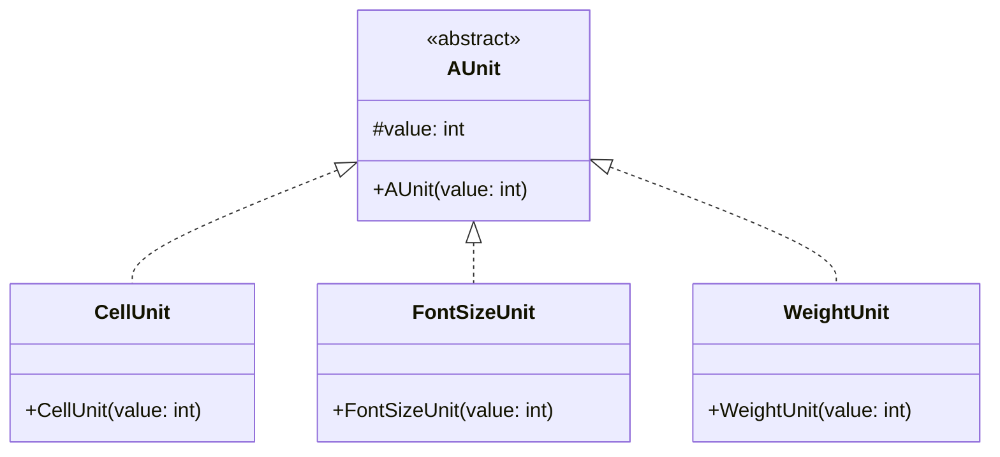
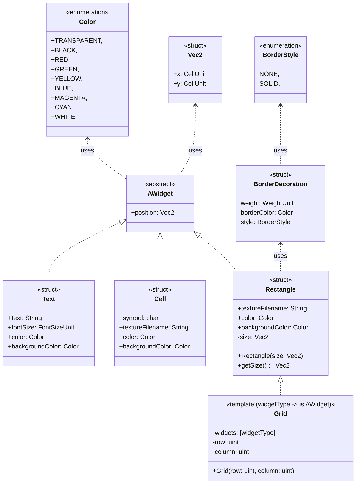
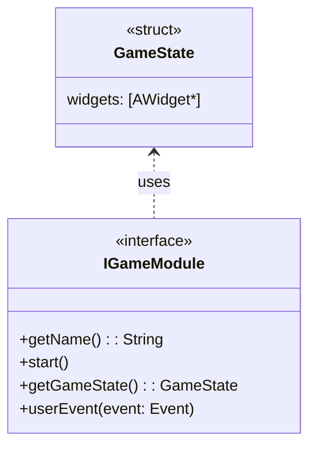

# Project comprehension
We aim to create an arcade platform capable of running multiple games with multiple graphic libraries by switching them at runtime. And we decided to split the project into three main modules:

1. **Game Module**

This module deals with the game logic. It manages tasks like player movements, player scores, game state, background music, rewards sounds, and many other game-related events. It gets inputs from the **Core module** to manage and update the game state. The **Game module** provides an interface to the **Core module** for it to access the game state, game data, and information, to render it to the graphic library on each frame.

1. **Display Module**

This module deals with graphics (window, shape drawing, …) and events (keyboard events, mouse events, …). It provides an interface to the **Core module**. This interface provides features to handle graphical rendering such as window creation, opening a window, draw and display figures on the window, get events on that window, and many other features.

1. **Core module**

This module is the orchestrator of the whole program. Everything is handled there, including game libraries and graphic libraries. The core starts with a graphic library chosen at startup. It loads the libraries located at a given path. It manages multiple views: menu view at startup, game view, in game menu view, and maybe others (settings, …). It builds the game view with the game state on each frame using the game interface

Later on this page, I’ll try to design three versions of architecture. The first one will be a simple and basic architecture.

# Architecture - version 1

In this architecture, in addition to the three main modules, we will have another module that will help us to draw figures on the window more specifically. It will be the **Widget module**.

Let’s start with the widget module.

## Widget module

In this module, we introduce a base `Widget` type to group all visual elements exposed by the Game module to the Core.

The purpose of this module is to provide a simple and generic representation of the game state from a rendering point of view, independently of the graphic library being used.

Widgets are **purely descriptive**: they do not contain game logic and do not perform any action by themselves. They only describe how a part of the game should be displayed.

This design allows the Game module to store all its visual elements in a single container, such as a list or a vector, while keeping a unified interface for the Core.

The first widgets we can define are:

- `Grid`: to represent the main game area;
- `Cell` or `Tile`: to represent one element of a grid;
- `Rectangle`: for simple shapes and UI blocks;
- `Text`: for labels, scores, menus, and messages.

We can add other widgets later if needed.

To make the rendering system compatible with different graphic libraries, we also define a small set of common unit types used by widgets. These units provide a shared reference for dimensions and positions across all display backends.

For example:

- `CellUnit`: for positions and dimensions in grid-based layouts;
- `FontSizeUnit`: for text sizing;
- other units as needed.

`CellUnit` and `FontSizeUnit` are lightweight value types. Their comparison operators can be defined outside the class to keep the shared interface minimal.

## Unit types

### UML diagram



### C++ interface

```c++

namespace arcade {
namespace widget {
// ===================== Widget module =====================
class AUnit {
public:
    AUnit() = default;

    explicit AUnit(const int &value): _value(value)
    {}

    AUnit(const AUnit &) = default;

    AUnit(AUnit &&) noexcept = default;

    AUnit &operator=(const AUnit &) = default;

    AUnit &operator=(AUnit &&) noexcept = default;

    virtual ~AUnit() = 0;

    [[nodiscard]] unsigned int getValue() const noexcept
    {
        return _value;
    }

protected:
    int _value{0};
};

inline AUnit::~AUnit() = default; // should be in a .cpp file to avoid
//multiple definitions

class CellUnit: public AUnit {
public:
    explicit CellUnit(const int &value): AUnit{value}
    {}

    ~CellUnit() override = default;
};

class FontSizeUnit: public AUnit {
public:
    explicit FontSizeUnit(const int &value): AUnit{value}
    {}

    ~FontSizeUnit() override = default;
};

class WeightUnit: public AUnit {
public:
    explicit WeightUnit(const int &value): AUnit{value}
    {}

    ~WeightUnit() override = default;
};
}
}
```

## Widget types

### UML diagram



### C++ interface

```c++
namespace arcade {
namespace widget {
enum class Color: uint8_t {
    TRANSPARENT = 0,
    BLACK,
    RED,
    GREEN,
    YELLOW,
    BLUE,
    MAGENTA,
    CYAN,
    WHITE,
};

struct Vec2 {
    CellUnit x;
    CellUnit y;
};

enum class WidgetType: uint8_t {
    UNKNOWN = 0,
    TEXT,
    TILE,
};

struct AWidget {
    AWidget() = default;

    virtual ~AWidget() = 0;

    WidgetType type = WidgetType::UNKNOWN;
    Vec2 position   = {.x = CellUnit{0}, .y = CellUnit{0}};
};

inline AWidget::~AWidget() = default; // should be in a .cpp file to avoid
// multiple definitions

struct Text: AWidget {
    std::string text;
    FontSizeUnit fontSize = FontSizeUnit{12};
    Color textColor       = Color::WHITE;
    Color backgroundColor = Color::BLACK;
};

struct Tile: AWidget {
    std::string symbol = " ";
    std::string textureName;
    Color color           = Color::WHITE;
    Color backgroundColor = Color::BLACK;
};

enum class BorderStyle: uint8_t {
    NONE = 0,
    SOLID,
};

struct BorderDecoration {
    WeightUnit weight = WeightUnit{0};
    Color borderColor = Color::WHITE;
    BorderStyle style = BorderStyle::NONE;
};

struct Rectangle: AWidget {
    explicit Rectangle(const Vec2 &size): _size{size}
    {}

    [[nodiscard]] Vec2 getSize() const noexcept
    {
        return _size;
    }

    void setSize(const Vec2 &size) noexcept
    {
        _size = size;
    }

    BorderDecoration decoration;
    Color fillColor = Color::BLACK;
    std::string textureName;

private:
    Vec2 _size = {.x = CellUnit{0}, .y = CellUnit{0}};
};

struct TileGrid: Rectangle {
    explicit TileGrid(const std::size_t &row, const std::size_t &column);

    std::vector<Tile> &operator[](const std::size_t &row);

private:
    std::vector<std::vector<std::vector<Tile>>> _widgets;
    std::size_t _row    = 0;
    std::size_t _column = 0;
};

enum class KeyCode: int8_t {
    UNKNOWN = -1,
    KEY_A,
    KEY_B,
    KEY_C,
    KEY_D,
    KEY_E,
    KEY_F,
    KEY_G,
    KEY_H,
    KEY_I,
    KEY_J,
    KEY_K,
    KEY_L,
    KEY_M,
    KEY_N,
    KEY_O,
    KEY_P,
    KEY_Q,
    KEY_R,
    KEY_S,
    KEY_T,
    KEY_U,
    KEY_V,
    KEY_W,
    KEY_X,
    KEY_Y,
    KEY_Z,
    KEY_0,
    KEY_1,
    KEY_2,
    KEY_3,
    KEY_4,
    KEY_5,
    KEY_6,
    KEY_7,
    KEY_8,
    KEY_9,
    KEY_F1,
    KEY_F2,
    KEY_F3,
    KEY_F4,
    KEY_F5,
    KEY_F6,
    KEY_F7,
    KEY_F8,
    KEY_F9,
    KEY_F10,
    KEY_F11,
    KEY_F12,
    UP,
    DOWN,
    RIGHT,
    LEFT,
    ESC,
    ENTER,
    BACKSPACE,
    COUNT
};

enum class MouseButton: uint8_t {
    NONE = 0,
    LEFT,
    RIGHT,
};

class Event {
public:
    struct KeyEvent {
        KeyCode code = KeyCode::UNKNOWN;
        bool alt     = false;
        bool ctrl    = false;
        bool shift   = false;
        bool system  = false;
    };

    struct MouseButtonEvent {
        MouseButton button = MouseButton::NONE;
        int x              = 0;
        int y              = 0;
    };

    enum class EventType: uint8_t {
        NONE = 0,
        CLOSED,
        KEY_PRESSED,
        KEY_RELEASED,
        MOUSE_BUTTON_PRESSED,
        MOUSE_BUTTON_RELEASED,

        COUNT,
    };

    EventType type = EventType::NONE;

    union {
        KeyEvent key;
        MouseButtonEvent mouseButton;
    };
};

struct GameState {
    std::forward_list<std::unique_ptr<AWidget>> widgets;
    std::forward_list<std::string> sounds;
};

struct Resource {
    std::unordered_map<std::string, std::string> textures;
    std::unordered_map<std::string, std::string> sounds;
};
}
}
```

## Game module

As said above, the game module will provide a simple interface that will let the Core now information about the game state. That means that the game loop should never be implemented in the **Game Module**. It should instead be in the **Core Module**. Let’s start by listing which kind of information the **Game module** can provide on the game state.

- the name of the game
- background music
- in game sounds
- the game area or game map
- the score
- the leader board

To handle all those data effectively, the Game interface will be like this:

### UML diagram



### C++ interface

```c++

namespace arcade {
namespace game {
// ===================== Game Module =====================
class IGameModule {
public:
    IGameModule() = default;

    virtual ~IGameModule() = 0;

    [[nodiscard]] virtual std::string getName() const noexcept = 0;

    virtual void start() noexcept = 0;

    [[nodiscard]] virtual const widget::GameState &getGameState() noexcept = 0;

    virtual void userEvent(const widget::Event &input) = 0;

    [[nodiscard]] virtual const widget::Resource &getResource() const noexcept = 0;
};
}
}
```

## Display module

### C++ interface

```c++

namespace arcade {
namespace display {
// ===================== Display module =====================
class IDisplayModule {
public:
    IDisplayModule() = default;

    virtual ~IDisplayModule() = default;

    virtual void closeWindow() noexcept = 0;

    virtual void openWindow() noexcept = 0;
    virtual void openWindow(const widget::Vec2 &size) noexcept = 0;

    [[nodiscard]] virtual bool isOpen() const noexcept = 0;

    virtual void draw(const widget::AWidget &widget) = 0;

    virtual void clear(const widget::Color &color) noexcept = 0;

    virtual void display() noexcept = 0;

    virtual void playSound(const std::string &soundName) noexcept = 0;

    virtual void loadResource(const widget::Resource &resources) = 0;

    [[nodiscard]] virtual widget::Vec2 getWindowSize() const noexcept = 0;

    virtual bool pollEvent(widget::Event &event) = 0;

    virtual const std::string &getName() const noexcept = 0;
};
}
}
```